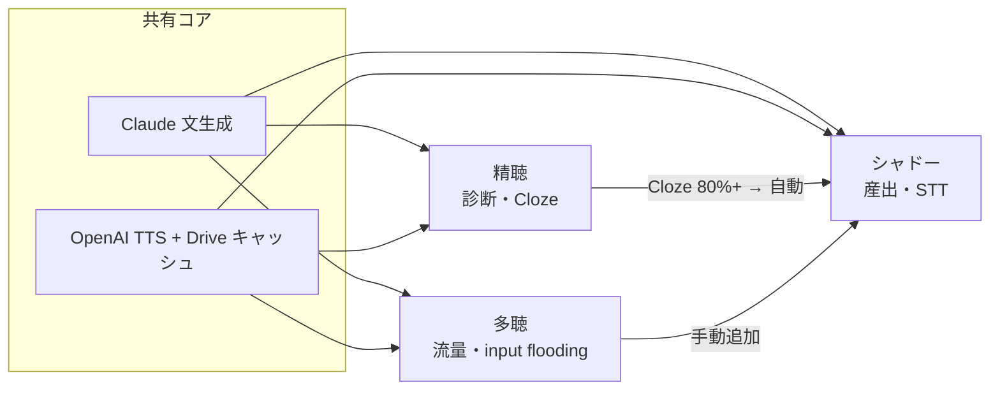

> **廃止** — [architecture.md](../architecture.md)、[extensive.md](../extensive.md)、[shadowing.md](../shadowing.md) に統合済み。

# English Listening Trainer — 多聴・シャドーイング 仕様整理

> 参照元: `docs/background.md`（v1 思想）、`docs/listening-trainer-v2-work-request.md`（v2 アーキテクチャ）、現行コード（`src/shells/extensive/`、`src/shells/shadowing/`）
>
> Claude 等との相談用に、思想・現状仕様・今後の構想を1箇所にまとめたドキュメント。

---

## 1. アプリ全体の設計思想

### 1.1 解こうとしている課題

日本人学習者のリスニングにおける最大のボトルネックは **層3：連結部**（リンキング・弱形・脱落・縮約）である。既存の多聴・シャドーイング教材は「どこを聞き落としたか」が構造化されず、曖昧な手応えのまま反復が続く。

本アプリの出発点は **層3を主戦場に、聞き落としを構造化されたフィードバックとして返す** こと。副次的に層2（弱形復元）・層4（ミニマルペア）にも効く。

### 1.2 v2 以降：3シェル統合アーキテクチャ

v2 で **1つのアプリ内に3つの「シェル」** を置く。分割軸は素材ではなく **鍛える回路（MECE）** である。

| シェル | 主たる回路 | UX方針 | 思想 |
|---|---|---|---|
| **精聴 (Intensive)** | 知覚：層3の**どこを**落としたか診断 | 難・少・制約 | v1 思想をそのまま維持 |
| **多聴 (Extensive)** | 知覚：音→意味の**自動化** | 易・多・無摩擦 | v1 の「多聴は外部補完」を**アプリ内に取り込む** |
| **シャドーイング (Shadowing)** | 産出：運動記憶・プロソディ定着 | 中・反復・段階解放 | v1 の「産出スコープ外」を**このシェルに限り解禁** |

3シェルは **素材を共有** する（多聴で理解したパッセージ → シャドーへ、など）。

### 1.3 共有コア

3シェル共通の基盤:

- **文生成**: Claude API（CEFR 制約・構造フラッグ・`target_features` 付き）
- **音声**: OpenAI TTS（GAS 経由）+ Google Drive キャッシュ
- **3軸設定**: シーン × **CEFR**（A1+A2 / B1 / B2）× **音韻Lv**（1〜5）

### 1.4 精聴 vs 多聴：意図的な思想の逆転

| 精聴 | 多聴 |
|---|---|
| 診断精度 > 完遂量 | 完遂量（接触量）> 診断 |
| Cloze で「どこを落としたか」可視化 | 正答率を測らない |
| リプレイ制限・自然速度中心 | リプレイ自由・倍速・連続再生 |
| 1問単位の摩擦 UI | スワイプで次へ・低摩擦 |
| 単文中心 | 連続パッセージ・対話 |

多聴は精聴の「対極」として設計されている。混同しないことが v2 の前提。

### 1.5 シャドーイングの位置づけ

`background.md` v1 では産出側（発音・流暢性）はスコープ外としていた。v2 では **シャドーイングシェルに限り産出を正式に取り込む**。

核心原則:

- **理解 → その後シャドー** の段階化
- 素材は **すでに理解済みのもの**（多聴で読んだ／精聴で 80% 以上のパッセージ）
- 「文法を反復発声で学ぶ」は低価値 → 対象は **チャンク・プロソディ・連結**（`target_features` ベース）

---

## 2. 多聴（Extensive）— 現状仕様

### 2.1 目的

- 知覚回路の **自動化**（リアルタイム速度に間に合う処理）
- **input flooding**: 特定の文法構造（関係詞節・分詞構文・仮定法・倒置）を意図的に大量接触させる
- 診断は行わず、**累計接触量** で効果を測る

### 2.2 セットアップ画面（開始前）

ユーザーが選ぶ項目:

| 項目 | 選択肢 | 備考 |
|---|---|---|
| CEFR | A1+A2 / B1 / B2 | 語彙・チャンクの複雑性 |
| シーン | 電話 / 店舗 / 職場 等 | 語彙ドメイン・レジスター |
| 音韻Lv | 1〜4（Lv5 対話は多聴 UI では非表示） | 速度・縮約密度 |
| コンテンツ長 | 短いパッセージ（3〜6文）/ 長い（5〜8文）/ 対話（4〜8ターン） | |
| 構造フラッグ | 関係詞節 / 分詞構文 / 仮定法 / 倒置 | 任意・複数選択可 |
| 表示モード | 読みながら聞く / 聞くだけ | デフォルト: 読みながら |

**構造フラグ ON 時の生成制御:**

- プロンプトに「各パッセージに該当構造を2回以上含める」旨を注入
- 生成後、パターン検証（regex）で **80%以上の文** に構造が含まれるかチェック
- 不合格なら最大5回再生成。それでも不合格の場合は **そのまま配信**（現実装）

**Past items（履歴）:**

- 聴いたパッセージを保存。音声はブラウザ + Google Drive にキャッシュ
- 端末間同期あり

### 2.3 聴取画面（セッション中）

| 機能 | 動作 |
|---|---|
| Read+Listen | 英語スクリプト + 日本語訳 + 自動再生 |
| Listen Only | スクリプト非表示。タップで訳文の表示/非表示 |
| 速度 | 1.0x / 1.25x / 0.85x を切替 |
| 自動 ON/OFF | ON: パッセージ終了 → 次を先読み生成して連続再生。OFF: 1本で停止 |
| スワイプ | 上下で前後のパッセージへ |
| シャドーに追加 | 現在のパッセージをシャドーキューへ送る |
| セットアップ | 設定画面に戻る（セッション終了） |

### 2.4 統計（Listening Stats）

正答率は測らない。localStorage + Google Drive 同期で累計を保持:

| 指標 | 意味 |
|---|---|
| 合計 ○分 | 再生完了したパッセージの累計時間 |
| パッセージ ○ | 再生完了（`onEnded`）回数 |
| 構造フラグ別 ○× | **そのフラグ ON で聴いた回数**（文中の出現回数ではない） |
| 構造検証合格率 ○% | フラグ ON セッションで、生成文が検証を通過した割合 |

**仕様上あるが UI 未表示:** 各チャンクの遭遇回数（`chunkEncounters`）— データは記録されるが画面には出ていない。

### 2.5 多聴が意図的にやらないこと

- Cloze / ディクテーション / 正答率
- リプレイ回数制限
- 層3 の個別診断フィードバック（それは精聴の役割）

---

## 3. シャドーイング（Shadowing）— 現状仕様

### 3.1 目的

- **産出回路**の定着（運動記憶・プロソディ・連結）
- 「話せないものは聞き取れない」— 層3 強化のための産出側トレーニング
- 精聴の「ズレを構造化して返す」思想を、STT 照合で産出側に転用

### 3.2 素材の供給経路（3通り）

```
精聴（Cloze 80%以上）──→ 自動候補追加（理解済みバッジ付き）
多聴（手動「シャドーに追加」）──→ キューへ
シャドー画面（Generate new）──→ その場生成
```

キューは最大50件。Google Drive で端末間同期。

### 3.3 Stage 設計（3段階・手動切替）

| Stage | 名称 | UI | 鍛える回路 |
|---|---|---|---|
| 1 | Sync | スクリプト表示 + モデル音声 | 視覚補助下でリズムに乗る |
| 2 | Shadow | スクリプト非表示 + モデル音声 | 音→産出運動の直結 |
| 3 | Prosody | `target_features` に基づくハイライト + モデル音声 | 弱形・連結・縮約を意識 |

Stage 1→2→3 はユーザーが自由に切替。順序強制なし。

### 3.4 録音・フィードバック

| 種別 | 実装 | 内容 |
|---|---|---|
| 自己照合 | MediaRecorder + モデル/自分の切替再生 | 主観評価 |
| STT照合 | Web Speech API（MVP） | 認識テキストとスクリプトの単語単位 diff |
| 完了判定 | `match_score >= 0.8` | Stage 完了マーク（✓） |

録音履歴は localStorage + Drive 同期。

**Stage 3 のプロソディ可視化:** `target_features` ベースのテキストハイライトのみ。波形・ピッチ抽出は **未実装**（Phase 6 構想）。

### 3.5 シャドーイングが意図的にやらないこと（現時点）

- ピッチ可視化・プロソディスコアリング（Phase 6）
- OpenAI Whisper による高精度 STT（Phase 6 で選択肢化予定）
- 文法解説
- 理解度テスト（理解済み素材を使う前提）

---

## 4. 3シェルの関係（素材フロー）



**学習パスの想定:**

1. **多聴** で大量接触（意味が取れる量を浴びる）
2. **精聴** で層3 の弱点を診断（必要に応じて）
3. **シャドー** で理解済み素材の産出定着

順序は固定ではない。多聴 → シャドー の直行も想定内。

---

## 5. この先の構想（仕様書上のロードマップ）

### 5.1 Phase 5 完了時点の受け入れ条件（v2 全体）

- 3シェル独立動作 + CEFR 軸共通
- 構造フラッグ input flooding 機能
- Drive キャッシュで TTS 2回目以降ゼロ
- STT 照合（Web Speech API）動作
- 多聴・精聴 → シャドー素材連携

### 5.2 Phase 6 以降（明示的スコープ外 → 将来）

| 項目 | 内容 |
|---|---|
| ピッチ可視化・プロソディスコアリング | pitch.js 等で強勢パターンのズレを視覚化 |
| Whisper STT | Web Speech API からの切替選択肢 |
| C1・C2 | 当面 B2 まで |
| 語彙・チャンク多読アプリ | **別仕様書**（Q2 として分離） |

### 5.3 横断的な将来拡張（background.md §6.3 + v2 §8）

| 優先度 | 内容 | 対象 |
|---|---|---|
| 高 | 進捗永続化・弱点トラッキング（feature 別正答率） | 主に精聴 |
| 高 | スパース・リピート出題（弱点 feature を生成に反映） | 精聴 |
| 中 | IPA 表示オプション | 精聴 Review |
| 中 | シーン拡張（友達雑談等） | 全シェル |
| 低 | Lv6（同性ペア対話） | 精聴 Lv5 拡張 |
| 低 | 音素レベルミニマルペア | 精聴 |

多聴・シャドー固有の将来構想:

| 項目 | 状態 |
|---|---|
| チャンク遭遇数の UI 表示 | データ記録済み、表示未実装 |
| 音声キャッシュ事前生成バッチ（warmup） | GAS スクリプト存在、任意拡張 |
| ドキュメント分割（`extensive.md` / `shadowing.md`） | Phase 5 完了後の整理作業として計画 |
| `background.md` の産出スコープ外記述 | v2 実装後に更新予定（現状は v1 記述が残存） |

### 5.4 多聴・シャドーで検討中の UX 論点（実装と仕様のギャップ）

前回の UI レビューで浮上した点。仕様書には明記されていないが、相談材料として:

| 論点 | 現状 | 検討方向 |
|---|---|---|
| 聴取中の Stats 表示 | setup + 聴取中の両方に表示 | 聴取中は非表示にする案 |
| 構造検証合格率 0% | 技術指標だがユーザーには分かりにくい | 非表示 or ラベル改善 |
| 構造カウンター「2560×」 | フラグ ON セッション数 | ラベル明確化 |
| シャドーに追加 | フィードバックなし | 精聴同様の「追加済み」表示 |
| 構造フラッグ検証 | 5回リトライ後に不合格でも配信 | 合格率 0% の原因になりうる |

---

## 6. 相談時の論点（Claude への問いかけ例）

1. **3シェルの分担**は MECE として妥当か。多聴と精聴の「思想の逆転」をユーザーが理解できる UI 文言は何が適切か。
2. **input flooding（構造フラッグ）** は多聴の核心機能だが、検証合格率 0%・カウンター表示はユーザー価値があるか。改善案は。
3. **シャドーイング Stage 3** の `target_features` ハイライトは、本格的プロソディ訓練として十分か。Phase 6（ピッチ可視化）の優先度は。
4. **素材フロー**（多聴 → シャドー）の UX：手動追加 vs 自動候補のバランスは適切か。
5. **background.md v1**（産出スコープ外）と **v2**（シャドーで解禁）の思想整合を、ドキュメント上どう整理すべきか。

---

*作成: 2026-06-20 / 相談用サマリー*
